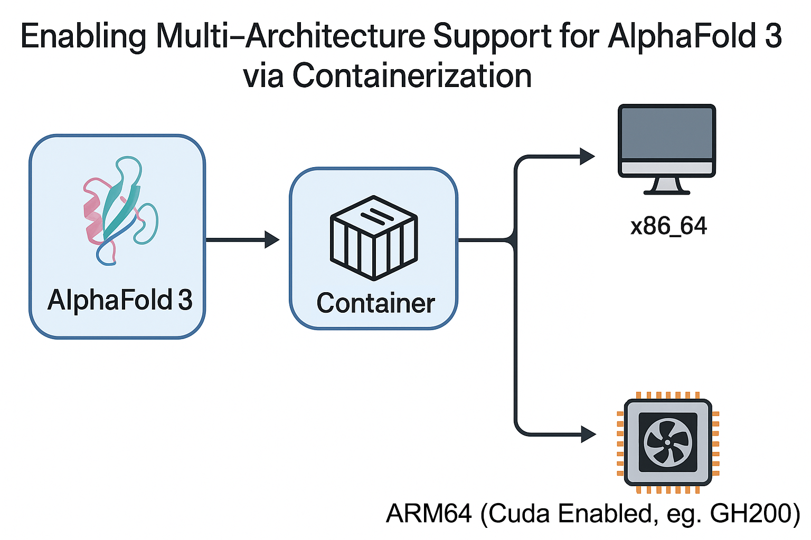

# AlphaFold 3 Singularity Container Build

This repository contains scripts to build a Singularity container for AlphaFold 3, currently optimized for **ARM64 systems with NVIDIA GPUs** (like NVIDIA Grace Hopper), and a Python launcher script to run predictions. This setup has been tested on NVIDIA GPUs.

*Note: An x86-compatible definition file is planned for future release.*

## Architecture Overview



## Prerequisites

-   Access to a system with Singularity (or Apptainer) installed.
-   Access to the internet to download dependencies and clone repositories.
-   Access to a SLURM-managed cluster (if using the provided `build_af3.slurm` script).

## Database Download

AlphaFold 3 requires large sequence and structure databases to function.

**Requirement:** You must download these databases separately.
**Recommendation:** Use the official script provided by Google DeepMind:

1. Clone the official AlphaFold 3 repository:
   ```bash
   git clone https://github.com/google-deepmind/alphafold3.git
   cd alphafold3
   ```
2. Run the download script (this requires `wget` and `zstd`):
   ```bash
   ./fetch_databases.sh /path/to/your/database/storage
   ```
   Replace `/path/to/your/database/storage` with the desired location.

**Note:** The databases require significant disk space (~252 GB download, ~630 GB uncompressed). An SSD is recommended for better performance.

## Files

-   `build_af3.slurm`: SLURM batch script to build the Singularity container. **Requires user modification.**
-   `alphafold3.def`: Singularity definition file (ARM64 NVIDIA optimized) detailing the container setup.

## Pre-built Container (Sylabs Cloud)

A pre-built Singularity image file (`.sif`) based on this definition may be available on Sylabs Cloud:

*   **Link:** [Sylabs Cloud Link Placeholder - To Be Added]

Using the pre-built container can save you the time and resources needed for building it yourself.

## Building the Container

1.  **Configure SLURM Script**: Before submitting, open `build_af3.slurm` and replace the placeholder values:
    *   `#SBATCH --partition=YOUR_PARTITION`: Set this to the appropriate SLURM partition/queue for your cluster.
    *   `#SBATCH --account=YOUR_ACCOUNT`: Set this to your SLURM allocation/account name.
    *   *(Optional)* Adjust other SBATCH directives (like `--time`, `--mem`, `--cpus-per-task`, `--gres`) as needed for your environment and resource limits.

2.  **Ensure the Definition File Exists**: Make sure the `alphafold3.def` file is present in your working directory or provide an absolute path when submitting.

3.  **Submit the SLURM Job**: Use the `sbatch` command to submit the build job, passing the path to the definition file as the first argument and the desired build directory as the second argument.

    ```bash
    sbatch build_af3.slurm alphafold3.def /path/to/your/build/directory
    ```

    *Replace `alphafold3.def` with the actual path to your definition file if it's different or located elsewhere.*
    *Replace `/path/to/your/build/directory` with the desired location for the final container image.*

4.  **Monitor the Build**: Check the output and error files (e.g., `alphafold3_build_*.out`, `alphafold3_build_*.err`, where `*` is the job ID) for progress and potential issues.

5.  **Locate the Container**: Upon successful completion, the container image (`alphafold3.sif`) will be located in the build directory you specified when submitting the job.

## Running the Container

Refer to the `%help` section within the `alphafold3.def` file for instructions on how to run the built container.

## Running Predictions (using Launcher Script)

The `run_alphafold3_launcher.py` script provides a convenient way to run predictions using the Singularity container.

1.  **Prerequisites:**
    *   Python 3.x
    *   `spython` and `absl-py` Python libraries: `pip install spython absl-py`
    *   A built `alphafold3.sif` container (see Building the Container section).
    *   Downloaded AlphaFold 3 model parameters.
    *   Downloaded databases (see Database Download section).

2.  **Configuration:**
    *   Ensure the `_ALPHAFOLD3_SIF_PATH` variable inside `run_alphafold3_launcher.py` points to your `alphafold3.sif` file, OR set the `ALPHAFOLD3_SIF` environment variable.

3.  **Execution:**
    ```bash
    python run_alphafold3_launcher.py \
        --json_path=/path/to/input.json \
        --model_dir=/path/to/model_params \
        --db_dir=/path/to/databases \
        --output_dir=/path/to/output \
        [--other-flags...]
    ```
    Replace the example paths with your actual paths.

    **Key Flags:**
    *   `--json_path`: Path to a single input JSON file.
    *   `--input_dir`: Path to a directory of input JSON files (alternative to `--json_path`).
    *   `--model_dir`: Path to the downloaded AlphaFold 3 model parameters.
    *   `--db_dir`: Path(s) to the downloaded databases (can be specified multiple times).
    *   `--output_dir`: Directory where results will be saved.
    *   `--use_gpu`: Set to `false` to run without GPU (only data pipeline).
    *   `--run_data_pipeline=false`: Skip the data pipeline step.
    *   `--run_inference=false`: Skip the inference step.
    *   Run `python run_alphafold3_launcher.py --help` to see all available options.
