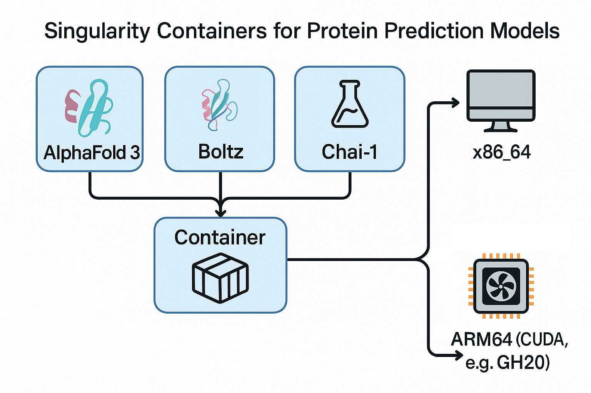

# Singularity Containers for Protein Prediction Models

This repository contains scripts to build Singularity containers for popular protein prediction models: **AlphaFold 3**, **Boltz**, and **Chai-1**. These containers are optimized for both **ARM64** and **x86** systems with NVIDIA GPUs and have been tested on such systems.

**Key Features:**
- **Cross-Architecture Support:** Provides definition files for both ARM64 (e.g., NVIDIA Grace Hopper) and x86_64 architectures.
- **AlphaFold 3:**
    - ARM64 support introduced.
    - x86_64 support.
    - Model weights **cannot** be pre-downloaded due to Google's Terms of Service; users must download them separately.
    - Requires local databases for full functionality (see "Database and Model Weights Download" section).
- **Boltz:**
    - ARM64 support introduced.
    - x86_64 support (pip installable, but container provides pre-configured environment).
    - Container includes pre-downloaded model weights.
    - Supports MSA generation via ColabFold API.
- **Chai-1:**
    - ARM64 support (already available via pip, but container offers a pre-configured environment).
    - x86_64 support.
    - Container includes pre-downloaded model weights.
    - Supports MSA generation via ColabFold API.

**Important Note on MSA Generation and Databases:**
-   **AlphaFold 3** natively requires local sequence and structure databases for its data pipeline. Users **must** download these databases separately (details below under "Database and Model Weights Download").
-   **Boltz** and **Chai-1** containers in this repository are configured to support MSA (Multiple Sequence Alignment) generation via the ColabFold API, offering an alternative to local database dependencies for this step.

## Architecture Overview



## Prerequisites

-   Access to a system with Singularity (or Apptainer) installed.
-   Access to the internet to download dependencies and clone repositories.
-   Access to a SLURM-managed cluster (if using the provided `build_container.slurm` script).

## Database and Model Weights Download

Each model has specific requirements for databases and model weights.

### AlphaFold 3
AlphaFold 3 requires large sequence and structure databases to function.

**Requirement:** You must download these databases separately.
**Recommendation:** Use the official script provided by Google DeepMind:

1. Clone the official AlphaFold 3 repository:
   ```bash
   git clone https://github.com/google-deepmind/alphafold3.git
   cd alphafold3
   ```
2. Run the download script (this requires `wget` and `zstd`):
   ```bash
   ./fetch_databases.sh /path/to/your/database/storage
   ```
   Replace `/path/to/your/database/storage` with the desired location.

**Note:** The databases require significant disk space (~252 GB download, ~630 GB uncompressed). An SSD is recommended for better performance.

### Boltz
The Boltz container comes with pre-downloaded model weights (`ccd.pkl` and `boltz1_conf.ckpt`) stored in `/opt/boltz_cache` within the container. No separate download is required for the weights if using the container.

### Chai-1
The Chai-1 container also includes pre-downloaded model weights. Specific paths and details can be found in the respective definition file.

## Files

-   **AlphaFold 3:**
    -   `alphafold3_arm.def`: Singularity definition file for ARM64 systems.
    -   `alphafold3_x86.def`: Singularity definition file for x86 systems.
    -   `build_container.slurm`: SLURM batch script to build the Singularity container. **Requires user modification.**
    -   `run_alphafold3_launcher.py`: Python script for convenient execution of the Singularity container.
-   **Boltz:**
    -   `boltz_arm.def`: Singularity definition file for ARM64 systems.
    -   `boltz_x86.def`: Singularity definition file for x86 systems (Note: x86 pip install is available, this container offers a pre-configured environment with weights).
-   **Chai-1:**
    -   `chai_lab_arm.def`: Singularity definition file for ARM64 systems.
    -   `chai_lab_x86.def`: Singularity definition file for x86 systems.

## Pre-built Containers (Sylabs Cloud)

A pre-built Singularity image file (`.sif`) based on this definition is available on Sylabs Cloud:

*   **Link:** [Sylabs Cloud Link Placeholder - To Be Added]

## Building the Containers

The `build_container.slurm` script can be used to build any of the model containers (AlphaFold 3, Boltz, Chai-1) on a SLURM-managed cluster. Alternatively, you can build them manually using Singularity commands.

### Using the SLURM Script (`build_container.slurm`)

1.  **Configure SLURM Script**: Before submitting, open `build_container.slurm` and ensure the following placeholder values are correctly set for your cluster environment:
    *   `#SBATCH --partition=YOUR_PARTITION`: Set this to the appropriate SLURM partition/queue.
    *   `#SBATCH --account=YOUR_ACCOUNT`: Set this to your SLURM allocation/account name.
    *   *(Optional)* You may want to adjust the job name, output/error file paths (e.g., `#SBATCH --job-name=my_build_job`, `#SBATCH --output=my_build_job_%j.out`). The script is set up to use variables like `${MODEL_NAME}` and `${ARCH}` in comments for these lines, but SLURM may not expand them from script variables; manual adjustment or generic names might be needed.
    *   *(Optional)* Adjust other SBATCH directives (like `--time`, `--mem`, `--cpus-per-task`, `--gres`) as needed.

2.  **Submit the SLURM Job**: Use the `sbatch` command to submit the build job. You need to specify the model name, target architecture, and the desired build directory.

    ```bash
    sbatch build_container.slurm <model_name> <architecture> /path/to/your/build/directory
    ```

    **Arguments:**
    *   `<model_name>`: The name of the model to build (e.g., `alphafold3`, `boltz`, `chai_1` - note: use `chai_lab` for def file names `chai_lab_arm.def`/`chai_lab_x86.def`).
    *   `<architecture>`: The target architecture (`arm` or `x86`).
    *   `/path/to/your/build/directory`: The directory where the SIF file will be saved.

    **Examples:**

    To build Boltz for ARM:
    ```bash
    sbatch build_container.slurm boltz arm ./build_output
    ```

    To build AlphaFold 3 for x86:
    ```bash
    sbatch build_container.slurm alphafold3 x86 ./build_output
    ```

3.  **Monitor the Build**: Check the SLURM output and error files (e.g., `boltz_arm_build_*.out`, `alphafold3_x86_build_*.err`, where `*` is the job ID, assuming you've set the SBATCH directives accordingly) for progress and potential issues.

4.  **Locate the Container**: Upon successful completion, the container image (e.g., `boltz_arm.sif`, `alphafold3_x86.sif`) will be located in the build directory you specified.


## CUDA Version Compatibility

> ⚠️ **Important**: The definition files may have CUDA versions hardcoded (e.g., AlphaFold 3 currently set to CUDA 12.6.0, Boltz ARM uses base Ubuntu 22.04 which is flexible but PyTorch is built with CUDA 12.8).

This might cause compatibility issues if your host system uses a different CUDA version. You have two options:

1. **Modify the Definition File**: Edit the `From:` line in the definition file to match your system's CUDA version:
   ```
   Bootstrap: docker
   From: nvidia/cuda:XX.X.X-runtime-ubuntu22.04
   ```
   Replace `XX.X.X` with your system's CUDA version.

2. **Use Environment Variables**: Override default settings when running the container to prevent CUDA errors.

### Troubleshooting

- If you encounter CUDA errors, try updating your NVIDIA drivers to the latest version
- For memory errors, decrease the `XLA_CLIENT_MEM_FRACTION` value (e.g., 0.75 or 0.5)
- Some systems may need to use `apptainer` instead of `singularity` command
- If you continue experiencing CUDA version mismatches, rebuilding the container with the matching CUDA version is recommended

## Running the Containers

Refer to the `%help` section within each definition file for architecture-specific instructions on running the built containers.

**General Execution (Example):**
```bash
singularity exec --nv /path/to/your/<model_name>_<arch>.sif <command_specific_to_model> <arguments>
```

### Running AlphaFold 3 Predictions (using Launcher Script)

The `run_alphafold3_launcher.py` script provides a convenient way to run predictions using the Singularity container.

1.  **Prerequisites:**
    *   Python 3.x
    *   `spython` and `absl-py` Python libraries: `pip install spython absl-py`
    *   A built Singularity container for your architecture (`alphafold3_arm.sif` or `alphafold3_x86.sif`).
    *   Downloaded AlphaFold 3 model parameters.
    *   Downloaded databases (see Database Download section).

2.  **Configuration:**
    *   Update the `_ALPHAFOLD3_SIF_PATH` variable inside `run_alphafold3_launcher.py` to point to your appropriate architecture-specific SIF file, OR set the `ALPHAFOLD3_SIF` environment variable.

3.  **Execution:**
    ```bash
    python run_alphafold3_launcher.py \
        --json_path=/path/to/input.json \
        --model_dir=/path/to/model_params \
        --db_dir=/path/to/databases \
        --output_dir=/path/to/output \
        [--other-flags...]
    ```
    Replace the example paths with your actual paths.

    **Key Flags:**
    *   `--json_path`: Path to a single input JSON file.
    *   `--input_dir`: Path to a directory of input JSON files (alternative to `--json_path`).
    *   `--model_dir`: Path to the downloaded AlphaFold 3 model parameters.
    *   `--db_dir`: Path(s) to the downloaded databases (can be specified multiple times).
    *   `--output_dir`: Directory where results will be saved.
    *   `--use_gpu`: Set to `false` to run without GPU (only data pipeline).
    *   `--run_data_pipeline=false`: Skip the data pipeline step.
    *   `--run_inference=false`: Skip the inference step.
    *   Run `python run_alphafold3_launcher.py --help` to see all available options.

### Running Boltz Predictions
(TODO: Needs to be filled in)

Example:
```bash
singularity run --nv boltz_arm.sif boltz <boltz_arguments>
```

### Running Chai Lab's Model Predictions
(TODO: Needs to be filled in.)

Example:
```bash
singularity run --nv chai_lab_arm.sif <chai_lab_executable> <arguments>
```

## Acknowledgements
- AlphaFold by DeepMind Technologies Limited
- Boltz-1 by Wohlwend, Jeremy, et al. "Boltz-1: Democratizing Biomolecular Interaction Modeling." bioRxiv (2024): 2024-11.
- Chai 1 by Chai Discovery, Inc.
- The research project is generously funded by Cornell University BRC Epigenomics Core Facility (RRID:SCR_021287), Penn State Institute for Computational and Data Sciences (RRID:SCR_025154) , Penn State University Center for Applications of Artificial Intelligence and Machine Learning to Industry Core Facility (AIMI) (RRID:SCR_022867) and supported by a gift to AIMI research from Dell Technologies.
- Computational support was provided by NSF ACCESS to William KM Lai and Gretta Kellogg through BIO230041
